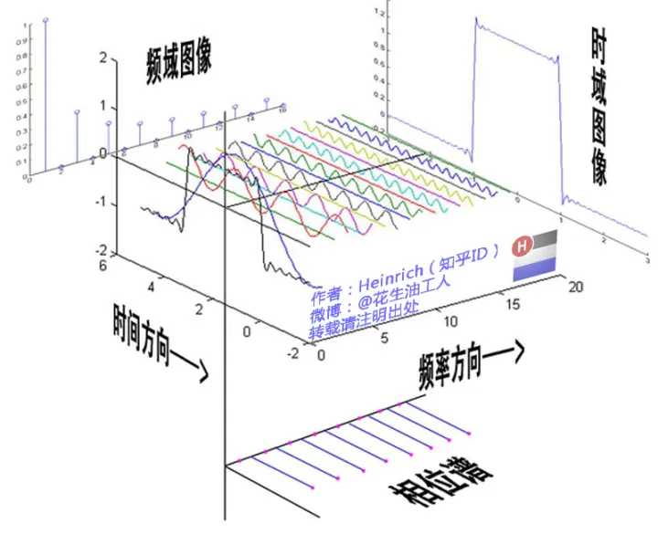

# 
信号与系统

## Fourier Transformation
> [参考原文 https://zhuanlan.zhihu.com/p/19763358](https://zhuanlan.zhihu.com/p/19763358)

 
&emsp;&emsp;在完整的立体图中，我们将投影得到的时间差依次除以所在频率的周期，就得到了最下面的相位谱。所以，频谱是从侧面看，相位谱是从下面看。

&emsp;&emsp;注意到，相位谱中的相位除了0，就是Pi。因为$cos(t+Pi)=-cos(t)$，所以实际上相位为Pi的波只是上下翻转了而已。对于周期方波的傅里叶级数，这样的相位谱已经是很简单的了。另外值得注意的是，由于cos（t+2Pi）=cos（t），所以相位差是周期的，pi和3pi，5pi，7pi都是相同的相位。人为定义相位谱的值域为(-pi，pi]，所以图中的相位差均为Pi。

<em>傅里叶级数的本质</em> 是将一个周期的信号分解成无限多分开的（离散的）正弦波。

是否有一种数学工具将连续非周期信号变换为周期离散信号呢？抱歉，真没有。

比如傅里叶级数，在时域是一个周期且连续的函数，而在频域是一个非周期离散的函数。这句话比较绕嘴，实在看着费事可以干脆回忆第一章的图片。

而在我们接下去要讲的傅里叶变换，则是将一个时域非周期的连续信号，转换为一个在频域非周期的连续信号。

或者我们也可以换一个角度理解：傅里叶变换实际上是对一个周期无限大的函数进行傅里叶变换。

***
<u> 离散谱的叠加，变成了连续谱的累积。所以在计算上也从求和符号变成了积分符号。 </u>

### 欧拉公式
在实轴上，乘正数表示拉长，乘负一则表示反向旋转了180°，而乘负一相当于乘了两次i，故可知乘一次i可得到旋转90°的结果，得到复平面。

欧拉公式：
$$ e^{ix} = cosx + isinx $$
当x = pi , $ e^{i*\pi} + 1 = 0 $

欧拉公式所描绘的，是一个随着时间变化，在复平面上做圆周运动的点，随着时间的改变，在时间轴上就成了一条螺旋线。如果只看它的实数部分，也就是螺旋线在左侧的投影，就是一个最基础的余弦函数。而右侧的投影则是一个正弦函数。

